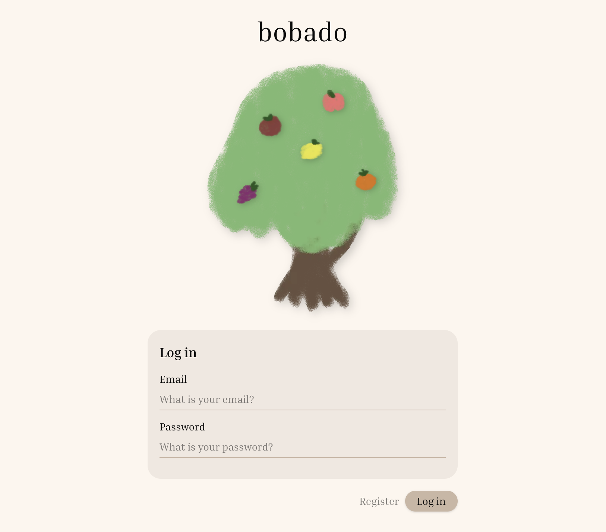
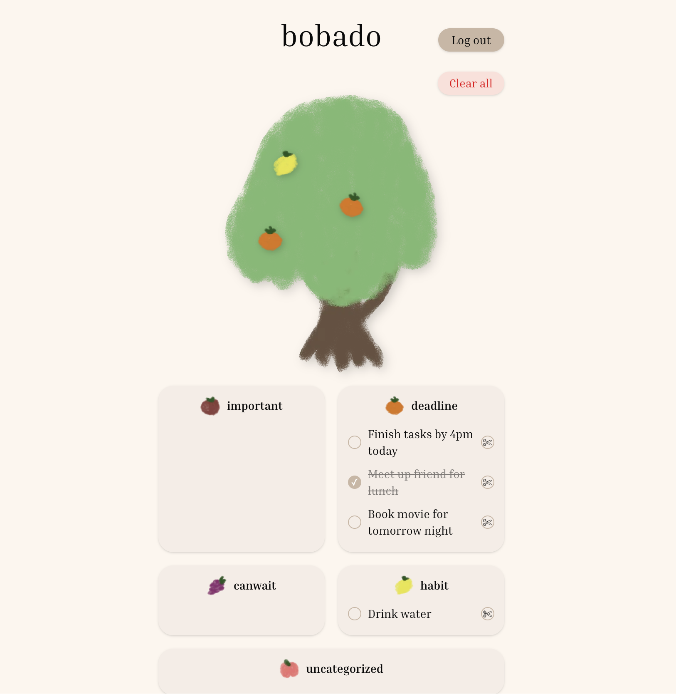

# 🌳 BobaDo

> watch your todos grow as fruits, pluck them when done!

BobaDo is a smart, natural language to-do app where your tasks grow as fruits on a tree. Type your day in plain language and the AI parses it into categorized tasks automatically. Tick off a task, pluck the fruit.

---

## Preview




## Features

- **Natural language input** - type like you are texting a friend. The AI reads it and breaks it into separate tasks.
- **Auto-categorization** - every task gets a label: Important, Can Wait, Deadline, Habit, or Uncategorized.
- **Recurring task detection** - habit-style tasks are flagged automatically.
- **Fruit tree visualization** - each incomplete task grows as a fruit on the tree. Complete it and the fruit disappears.
- **24 hour refresh** - todos expire automatically after 24 hours via MongoDB TTL index.
- **Persistent login** - users stay logged in across browser sessions until they manually log out.
- **One screen** - no sub-menus, no drilling. Everything visible at a glance.

---

## Tech Stack

- **Framework** - Next.js 16 (App Router)
- **Language** - TypeScript
- **Database** - MongoDB with Mongoose
- **Auth** - JWT stored in cookies
- **AI** - LLaMA 3.1 via DeepInfra (OpenAI-compatible API)
- **Styling** - Tailwind CSS v4
- **Animations** - Framer Motion, custom CSS keyframes
- **UI Components** - shadcn/ui, Sonner (toasts)
- **Images** - Next.js Image with WebP optimization

---

## Getting Started

### Prerequisites

- Node.js 18+
- MongoDB Atlas account
- DeepInfra API key (or OpenAI)

### Installation

```bash
git clone https://github.com/yourusername/bobado.git
cd bobado
npm install
```

### Environment Variables

Create a `.env.local` file:

```env
MONGO_URI=your_mongodb_connection_string
JWT_SECRET=your_jwt_secret
OPENAI_API_KEY=your_deepinfra_or_openai_api_key
NEXT_PUBLIC_BASE_URL=http://localhost:3000
```

### Run locally

```bash
npm run dev
```

---

## Project Structure

```
src/
  app/
    api/
      auth/         - login and register routes
      todos/        - CRUD routes + AI parsing
    login/          - login page
    register/       - register page
    todos/          - main todo page
  components/
    CategoryCard    - displays todos per category
    Tree            - fruit tree visualization
    DecorativeTree  - static tree for login/register pages
    Navbar          - app header with logout
    ClearAllBtn     - clear all todos with confirmation modal
  models/
    todo.model      - Mongoose schema with TTL index
    user.model      - Mongoose user schema
  types/
    todo.ts         - shared TypeScript types
  lib/
    db.ts           - MongoDB connection with caching
```

---

## How the AI Parsing Works

1. User types a natural language paragraph in the textarea
2. The POST route sends the text to LLaMA 3.1 with a structured prompt
3. The AI returns a raw JSON array of tasks with category, recurring flag, and deadline
4. Tasks are saved to MongoDB and returned to the frontend
5. The frontend sorts them into category cards and grows fruits on the tree

---

## Category Rules

| Category      | Description                               |
| ------------- | ----------------------------------------- |
| important     | urgent or high priority, no specific date |
| canwait       | low priority, no pressure                 |
| deadline      | has a specific date or time attached      |
| habit         | recurring activity, happens regularly     |
| uncategorized | does not fit any of the above             |

---

## Deployment

Deployed on Vercel. Add all environment variables in Vercel dashboard under Settings > Environment Variables. Set `NEXT_PUBLIC_BASE_URL` to your production URL.

---

## Illustrations

All fruit and tree illustrations are original hand-drawn artwork by the developer, compressed to WebP for performance.
